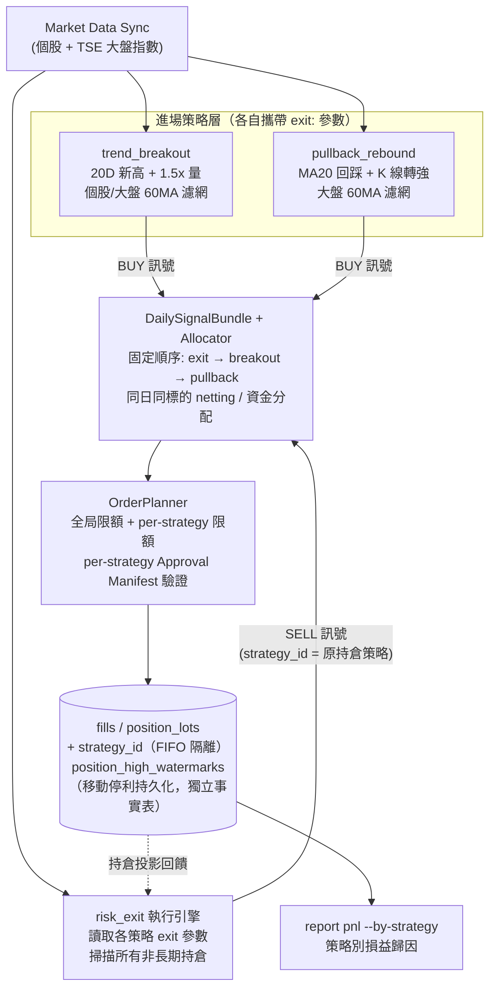
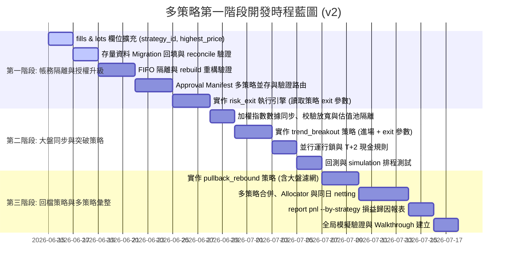

# 多策略架構設計與風險評估規劃書 (v3)

本文件整理自台股波段量化交易系統 MVP 進入第一階段多策略並行開發時的**策略規格**、**潛在系統風險**與**架構解決方案**。

> **v3 修訂摘要（對照實際程式碼審查後的決策與修正）**：
> 1. **四項拍板決策**：(a) 舊策略 `trend_pullback` 退役——補上 `exit:` 區塊、由 risk_exit 管理存量倉位直到出清，不再產生新進場訊號（§2.8）；(b) `exit:` 參數**納入** `params_hash`——變更退出參數需重新簽發授權（§2.10）；(c) `daily_runs` 採**單一 orchestrator run**（`strategy_id = 'MULTI'`），per-strategy 觀測性由 `signal_bundles` 承擔（§2.11）；(d) `MANUAL` 部位**排除**於 risk_exit 監控之外（§1.3、§2.8）。
> 2. `highest_price` 改存於**獨立 append-only 事實表 `position_high_watermarks`**，不放 `position_lots`——投影表會被 rebuild 清除重建，放在裡面與「防 rebuild 遺失」的目標自相矛盾（§2.2）。
> 3. **授權閘門只擋 BUY，SELL（尤其 RISK_EXIT）永不被阻擋**——否則授權過期那幾天停損全面失效（§2.7）。
> 4. Bundle 主鍵與取回邏輯升級：`bundle_id`/`signal_id` 納入 `strategy_id` 防撞鍵；執行時取回**當日全部** bundle 依固定順序合併，不再 `LIMIT 1`（§2.11）。
> 5. `realized_pnl` 與 `fifo_matches` 一併新增 `strategy_id`，否則 per-strategy 損益報表無資料基礎（§2.1）。
> 6. 指數同步補齊實作面：Shioaji provider 需支援 `Contracts.Indexs`、同步管線貫通 `instrument_type`、`DATASET_INCOMPLETE` 檢查涵蓋指數、上線前先回補 ≥60 交易日指數資料（§2.3）。
> 7. 現金規則正名為 **T+1 現金規則**（賣出款次一交易日可用）；並行鎖沿用既有 fcntl file lock，不另建 SQLite advisory lock（§2.9）。
> 8. 修正既有「未加權均價」bug：持倉快照之 `entry_price` 改為數量加權均價（§1.3）。
> 9. 明訂進場策略**已持有同標的即不再進場**（不自動加碼），避免突破策略於連續創高期間重複買入（§1.1、§1.2）。
>
> **v2 修訂摘要**：
> 1. 退出參數改為歸屬於各策略 YAML 的 `exit:` 區塊，`risk_exit` 降級為「執行引擎」而非獨立參數來源（§1.3、§2.6）。
> 2. 明確定義退出判斷單位為「`strategy_id` + `symbol` 彙總部位」，觸發即全數出場，不做部分出場（§1.3）。
> 3. 明確定義 SELL 訊號的 `strategy_id` 歸屬規則（§2.6）。
> 4. 修正回檔策略進場條件與均線失效退出條件互咬的問題（§1.2、§1.3）。
> 5. 為回檔策略補上大盤濾網（§1.2）。
> 6. 新增三個系統面風險：Approval 多策略並存、存量資料 Migration 回填、訊號管線確定性順序與同日對沖（§2.7–§2.9）。
> 7. 新增 per-strategy 損益報表與並行運行鎖至開發時程（§4）。

---

## 〇、 系統架構全覽



**架構閉環**：行情同步 → 三個策略元件平行產生訊號 → 合併去衝突 → 風控規劃 → 落帳 → 持倉投影回饋給退出引擎，形成每日確定性循環。

---

## 一、 第一階段三個核心策略規格

### 1.1 趨勢帶量突破策略 (Trend Breakout)

* **定位**：主買入選股策略，捕捉主流、強勢、題材啟動股。
* **適合情境**：大盤多頭、族群輪動明確、成交量放大、強勢股創波段新高。
* **買入進場條件**：
  * **突破高點**：收盤價高於前 20 日最高收盤價（創 20 日新高）。
  * **帶量確認**：當日成交量大於 20 日均量的 1.5 倍（`volume[-1] > mean(volume[-21:-1]) * 1.5`）。
  * **個股多頭**：收盤價高於 60 日均線（`close > sma_60`）。
  * **大盤多頭**：加權指數高於 60 日均線（`index_close > index_sma_60`）。
  * **未持有限制（v3 新增）**：本策略已持有該標的（同 `strategy_id` 之彙總部位 > 0）時不再進場，**不自動加碼**——突破策略在連續創高期間會每日重複觸發，若不限制，資金將被單一強勢股吸乾。
* **退出參數**（定義於 `config/strategies/trend_breakout.yaml` 的 `exit:` 區塊，由 risk_exit 引擎執行）：

  ```yaml
  exit:
    fixed_stop_loss_bps: 700        # 固定停損 -7%（以 position 加權均價計）
    trailing_stop_bps: 800          # 自持有後最高收盤價回落 8%
    ma_break_period: 20             # 均線失效：收盤跌破 20 日均線
    ma_break_confirm_days: 2        # 需連續 2 日收盤跌破才觸發（防單日洗盤）
    time_stop_days: 20              # 時間停損：持有 20 個交易日
    time_stop_min_return_bps: 500   # 累計報酬未達 +5% 則出場
  ```

### 1.2 回檔轉強策略 (Pullback Rebound)

* **定位**：輔助買入選股策略，避免只追突破，補足強勢股拉回平台或均線支撐後再起攻的進場點。
* **適合情境**：個股處於中長線多頭結構，短線回檔至重要支撐，且出現轉強跡象。
* **買入進場條件**：
  * **趨勢偏多**：收盤價高於 60 日均線 且 20 日均線高於 60 日均線（`close > sma_60` 且 `sma_20 > sma_60`）。
  * **回測支撐**：當日最低價回踩月線附近（`low <= sma_20 * 1.02`）。
  * **K線轉強**：今日收紅 K 且收盤價高於昨日收盤（`close > open` 且 `close > previous_close`）。
  * **大盤多頭（v2 新增）**：加權指數高於 60 日均線（`index_close > index_sma_60`）。
    > 理由：避免大盤剛跌破 60MA 的初跌段，回檔策略誤判個股「回踩支撐」而接刀。兩個進場策略本質上皆為 long-only 順勢策略，統一大盤濾網可在空頭期同步停止進場。
  * **未持有限制（v3 新增）**：同 §1.1，本策略已持有該標的時不再進場。
* **退出參數**（定義於 `config/strategies/pullback_rebound.yaml`）：

  ```yaml
  exit:
    fixed_stop_loss_bps: 500        # 固定停損 -5%（進場點貼近支撐，停損可較緊）
    trailing_stop_bps: 800
    ma_break_period: 20
    ma_break_buffer_bps: 200        # 收盤低於 sma_20 * 0.98 才觸發（v2 新增 buffer）
    ma_break_confirm_days: 2
    time_stop_days: 20
    time_stop_min_return_bps: 500
  ```

  > [!IMPORTANT]
  > **v2 修正——進場與退出互咬問題**：本策略買在月線邊緣（`low <= sma_20 * 1.02`），若均線失效條件維持原始的「收盤跌破 20 日均線即出場」，會造成進場隔日跌破月線 0.1% 即被掃出場的雜訊交易，手續費侵蝕獲利。故退出條件加上 **2% buffer + 連續 2 日確認**，給予支撐測試的容錯空間。

### 1.3 持股風險退出引擎 (Risk Exit Engine)

* **定位（v2 修訂）**：部位監控**執行引擎**，專職出場與風險控制，不進行選股、**亦不擁有自己的退出參數**。每個持倉 lot 依其 `strategy_id` 回溯至所屬策略 YAML 的 `exit:` 區塊取得參數。新增第四個策略時，只需在新策略 YAML 中定義 `exit:`，無須修改 risk_exit 程式碼。
* **監控對象（v3 明確定義）**：帳戶中所有「`strategy_id` 對應的策略 YAML 具有 `exit:` 區塊」且非長期持有（`is_long_term = 0`）的持倉部位。
  * `MANUAL`（手動錄入）部位**結構性排除**——它沒有所屬策略 YAML，自然沒有 exit 參數可回溯；手動部位是外部真實帳戶的鏡像，系統自動賣出會破壞對帳一致性與持有意圖。
  * 此規則同時取代散落各處的 `is_long_term` 特例分支：保護從「策略邏輯記得檢查 flag」變成「無 YAML 即不納管」的結構性保證。
* **退出判斷單位（v2 明確定義）**：以「`strategy_id` + `symbol` 的彙總部位（position）」為單位：
  * 固定停損與時間停損的「累計報酬」皆以 **position 加權均價**計算（**v3 註**：現行程式以 `AVG(price)` 取均價為未加權之 bug，升級時一併修正為 `SUM(price*quantity)/SUM(quantity)`）。
  * 移動停利的 `highest_price` 取該 position **持有期間最高收盤價**（首次建倉日起算；加碼不重置）。
  * **任一條件觸發，該 position 全數出場**。MVP 階段不做部分出場——部分出場會使 FIFO 帳務、回測重現性與報表複雜度大幅上升，收益有限。
* **觸發退出條件**（任一滿足即產生 `SELL` 訊號，參數值依來源策略 YAML）：
  * **固定停損**：收盤價跌破 position 加權均價 × (1 − `fixed_stop_loss_bps`)。
  * **移動停利**：自持有後最高收盤價回落 `trailing_stop_bps`。
  * **均線失效**：收盤價低於 `sma_{ma_break_period}` ×(1 − `ma_break_buffer_bps`)，且連續 `ma_break_confirm_days` 日成立。
  * **時間停損**：持有達 `time_stop_days` 個**交易日**（依台股交易日曆計算，非日曆日），且累計報酬未達 `time_stop_min_return_bps`。
* **SELL 訊號歸屬（v2 明確定義）**：
  * `strategy_id` = **持倉的原始策略 ID**（如 `trend_breakout`），確保 FIFO 隔離查詢與損益歸因正確。
  * 新增 `signal_source = 'risk_exit'` 與 `reason`（如 `TRAILING_STOP_EXIT`、`MA_BREAK_EXIT`）欄位記錄觸發來源。
  * ❌ 錯誤做法：`strategy_id = 'risk_exit'`——FIFO 查詢 `WHERE strategy_id = 'risk_exit'` 將找不到任何 lot。

---

## 二、 核心技術風險與解決方案

### 2.1 FIFO 帳務扣除與策略隔離衝突 (High Risk)

> [!CAUTION]
> **風險描述**：
> 當前 FIFO 撮合邏輯僅區分 `is_long_term`（隔離長線持股）。若策略 A（突破）與策略 B（回檔）同時持有 `2330`，策略 A 決定出場時，資料庫在 FIFO 計算時會直接扣掉帳戶中「最早買入」的 `2330` lot，這極可能扣到策略 B 的部位，導致策略間持倉互相污染、損益失真。

* **解決方案**：
  * **資料表升級**：在 `fills` 與 `position_lots` 資料表新增 `strategy_id` 欄位。**（v3 擴充）`realized_pnl` 與 `fifo_matches` 一併新增 `strategy_id`**——否則 §4 的 per-strategy 損益歸因報表沒有資料基礎，只能靠 `sell_fill_id` join 反查。
  * **FIFO 分組查詢**：修改 `PortfolioProjection._apply_fill_ops`，在執行 `SELL` 的 FIFO 扣除時，查詢條件必須限定為同一個 `strategy_id`：

    ```sql
    SELECT lot_id, quantity, price, fill_id FROM position_lots
    WHERE account_id = ? AND symbol = ? AND strategy_id = ? AND is_long_term = 0
    ORDER BY acquired_at ASC
    ```

### 2.2 移動停利 (Trailing Stop) 數據遺失與重播風險 (Medium Risk)

> [!IMPORTANT]
> **風險描述**：
> 移動停利需要知道「買入後的歷史最高價」。若只在記憶體中追蹤，一旦重置模擬（Reset）或重新從 Ledger 建構投影（Rebuild Projections），該最高價就會丟失。如果動態從 `market_bars` 回溯查詢，一旦歷史日 K 數據有缺漏，計算出的最高點就會偏低，導致停利點失效。

* **解決方案（v3 修訂——原 v2 方案有自相矛盾）**：
  * ❌ v2 原方案「存於 `position_lots`」不可行：`position_lots` 是投影表，`rebuild_from_ledger` 會 **DELETE 全部 lot 後從 fills 重建**，而 fills 不含最高價——rebuild 一跑欄位即歸零，正是本節要防的事故。
  * ✅ 改存於**獨立 append-only 事實表 `position_high_watermarks`**：`(account_id, strategy_id, symbol, trade_date, highest_close)`，PK 為前四欄。此表**不在** rebuild 的清除範圍內，與 `fills`/`cash_ledger` 同屬不可變事實層。
  * **更新機制**：每日模擬於「行情同步＋前日訊號執行」完成後、退出訊號產生前，對所有受監控 position upsert 當日收盤價一筆（PK upsert 保證冪等重跑）。
  * **彙總查詢**：position 最高價 = `MAX(highest_close) WHERE trade_date >= 該 position 最早 lot 的取得日`。以「現存 lot 的最早取得日」界定視窗，部位出清後重新建倉時舊高點自然失效，無需清理歷史列。

### 2.3 大盤指數 (TSE) 行情同步與 validator 阻擋風險 (Medium Risk)

> [!WARNING]
> **風險描述**：
> 突破與回檔策略皆需大盤指數（`TSE`）的 60MA 作為濾網。大盤指數在 API 獲取上沒有一般股票的「成交量 (volume)」或「成交金額 (amount)」，這在進行數據校驗時會觸發 `MarketBarValidator` 的阻擋，導致同步失敗。

* **解決方案（v3 補齊實作面）**：
  * **特別放寬校驗**：修改 `MarketBarValidator.validate`，若 `instrument_type == 'INDEX'`，放寬 `volume >= 0` 與 `amount >= 0` 條件，容許其為 0 或空值。
  * **Provider 支援指數合約（v3 新增）**：`ShioajiMarketDataProvider.fetch_kbars` 現僅查 `api.Contracts.Stocks`，需新增指數路由（符號 `TSE` → `api.Contracts.Indexs.TSE["001"]`），並將缺值 volume/amount 強制轉 0。
  * **同步管線貫通 instrument_type（v3 新增）**：`sync_market_data` 現硬編 `instrument_type="STOCK"`，需改由 universe 設定逐標的傳遞；`universe.yaml` 新增獨立 `indices:` 區段，與股票清單分離。
  * **完整性檢查涵蓋指數（v3 新增）**：`run_daily` 的 `DATASET_INCOMPLETE` 檢查必須包含指數，否則指數缺漏時大盤濾網將靜默誤判。
  * **上線前置依賴（v3 新增）**：策略啟用前必須先回補 **≥60 個交易日**的指數資料，否則 `index_sma_60` 永遠算不出來、兩個進場策略全面停擺。
  * **估值池隔離（v2 補充）**：`TSE` 僅作為策略濾網數據，**不得**被納入動態持倉估值池 (Valuation Universe)，避免報表將指數誤列為可交易標的。

### 2.4 多策略並行下的風控限額排擠 (Medium Risk)

> [!NOTE]
> **風險描述**：
> 當前風控限制如 `max_open_positions = 5` 是由 `OrderPlanner` 全局計算的。若策略 A 佔用 3 支、策略 B 佔用 2 支，策略 A 就會因全局滿額而無法再買入，形成策略間的額度排擠。

* **解決方案**：
  * **多維度限制設計**：
    * **全局帳戶風控 (Global Limits)**：整體帳戶的最大持倉上限與每日總金額，確保安全底線。
    * **策略專屬風控 (Strategy Limits)**：`plan_all` 按 `strategy_id` 單獨計算該策略的持倉數與累計購買額度，各策略擁有獨立預算。

### 2.5 同標的重複買入的資金配置與衝突 (Low Risk)

> [!TIP]
> **風險描述**：
> 策略 A 與策略 B 在同一天對同一檔股票產生 `BUY` 訊號時，若帳戶剩餘現金不足以支付兩筆委託，需要明確的權重規則決定資金分配。

* **解決方案**：
  * 在合併 `DailySignalBundle` 階段，實作「策略優先順序」分配器（Allocator）：**突破優先於回檔**（突破訊號代表動能已確認啟動，時效性較強）。
  * 若需更中性的方案，可配置為平分可用現金；分配規則寫入 config，不寫死於程式碼。

### 2.6 SELL 訊號歸屬與損益歸因錯置風險（v2 新增，High Risk）

> [!CAUTION]
> **風險描述**：
> 若 risk_exit 產生的 SELL 訊號將 `strategy_id` 標記為 `risk_exit`，FIFO 隔離查詢（§2.1）將找不到任何對應 lot 而扣帳失敗；即使改為不帶 `strategy_id` 全帳戶扣除，又會重蹈策略持倉污染的覆轍。同時，所有賣出損益會被歸到 `risk_exit` 名下，導致各進場策略的績效報表只有買入成本、沒有實現損益，完全無法評估策略優劣。

* **解決方案**：
  * SELL 訊號的 `strategy_id` 一律填**持倉的原始策略 ID**；觸發來源以 `signal_source` 欄位獨立記錄（見 §1.3）。
  * `signal_items` 資料表（v3 正名：實際 schema 為 `signal_bundles` + `signal_items`，非 `signals`）增加 `signal_source` 欄位（值域：`ENTRY` / `RISK_EXIT` / `MANUAL`）。
  * **落地形式（v3 明確化）**：risk_exit 對每個「有出場訊號的策略」各產生一份 exit bundle（bundle 的 `strategy_id` = 該策略），訊號項標記 `signal_source = 'RISK_EXIT'`——bundle 層與訊號層的 strategy_id 一致，FIFO 隔離查詢與損益歸因直接成立。

### 2.7 Approval Manifest 多策略並存風險（v2 新增，High Risk）

> [!CAUTION]
> **風險描述**：
> 現行授權模型為單一 `active-approval.json`（一次只有一份有效授權）。三策略並行後，若仍只有單一活動授權，要麼其他策略的 BUY 全數被拒，要麼系統用錯誤的 manifest 限額驗證訊號——兩者都破壞「BUY 必須匹配受信任授權」的防呆核心。

* **解決方案**：
  * **授權模型升級**：允許多份 manifest 同時處於 `ACTIVE` 狀態，以 `strategy_id` 為唯一鍵（同一策略同時只能有一份有效授權）。active pointer 由單一檔升級為 `active-approvals.json` map（`strategy_id → approval_id`）。
  * **驗證路由**：執行引擎驗證 BUY 訊號時，以訊號的 `strategy_id` 查找對應 manifest；查無有效授權即拒絕該策略全部 BUY，並記錄 `APPROVAL_NOT_FOUND` 事件。
  * **SELL 永不受授權閘門阻擋（v3 新增，安全關鍵）**：現行 `execute_bundle` 在 manifest 驗證失敗時直接 raise，**連 SELL 都不執行**——多策略下某策略授權過期的期間，其持倉的停損/停利將全面失效。升級後授權驗證僅作用於 BUY；`RISK_EXIT` 與其他 SELL 訊號一律放行。
  * CLI 調整：`approval activate` 改為按策略啟用/停用；`approval list` 顯示各策略當前有效授權與到期日。

### 2.8 存量資料 Migration 回填風險（v2 新增，Medium Risk）

> [!WARNING]
> **風險描述**：
> `fills` 與 `position_lots` 新增 `strategy_id` 與 `highest_price` 欄位後，既有歷史資料若留空（NULL），FIFO 分組查詢與移動停利判斷將直接失效或拋錯，且 rebuild projections 會產出與升級前不一致的帳務。

* **解決方案**：
  * **`strategy_id` 回填**：既有非手動 lot 與 fills（`source = 'STRATEGY'`）統一回填為 `trend_pullback`（升級前唯一策略）；手動錄入（`source = 'MANUAL_IMPORT'`）的回填為 `MANUAL`。**（v3 決策確定）`MANUAL` 部位排除於 risk_exit 監控之外**，理由見 §1.3。
  * **舊策略 `trend_pullback` 退役（v3 決策確定）**：回填後的存量倉位需要出場歸屬——為 `trend_pullback.yaml` 補上 `exit:` 區塊，納入 risk_exit 監控直到存量出清；該策略**不再加入進場管線**（其進場邏輯與 `pullback_rebound` 高度重疊，並行會重複曝險）。YAML 檔保留以供歷史損益歸因。
  * **watermark 回填**：從 `market_bars` 查詢各 position 最早 `acquired_at` 至今的最高收盤價；若該區間數據有缺漏，以「可查得的最高價」與「加權買入均價」取大者初始化，寫入 `position_high_watermarks`——此為一次性必要之惡，之後由每日更新機制（§2.2）持續維護。
  * **`realized_pnl`/`fifo_matches` 回填（v3 新增）**：`fifo_matches` 經 `sell_fill_id → fills.strategy_id` 回填；`realized_pnl` 經（帳戶、標的、`occurred_at`）對應之 SELL fill 回填，無法對應者落 `trend_pullback` 並列入異常清單。
  * Migration 腳本必須**冪等**且附帶回填筆數與異常清單的輸出報告；升級後立即執行 `portfolio reconcile` 驗證帳務一致性。

### 2.9 訊號管線順序、同日對沖與並行鎖（v2 新增，Medium Risk）

> [!WARNING]
> **風險描述**：
> （a）三策略執行順序若不固定，重播結果不可重現，違反系統核心目標。（b）策略 A 的 risk_exit 賣出 `2330` 而策略 B 同日買入 `2330`，帳務上 FIFO 隔離無誤，但實務上左手賣右手買，白繳兩次手續費與證交稅。（c）cron 重疊執行（前一日任務未完成、下一次已啟動）會導致訊號重複產生。

* **解決方案**：
  * **固定管線順序**：每日模擬一律依 `risk_exit → trend_breakout → pullback_rebound` 順序執行，順序定義於 config 並寫入訊號 bundle metadata。
  * **T+1 現金規則（v3 正名，原文誤稱 T+2）**：當日 SELL 釋放的現金**次一交易日**才可用於 BUY，避免回測高估資金週轉率。落地方式：Allocator 規劃 BUY 時不將當日 SELL 預估收益計入可用現金（現行 `plan_all` 會立即加回，需修正）。
  * **同日 netting 規則**：Allocator 合併 bundle 時，同日同標的 BUY/SELL 並存則 **exit 優先、抑制當日同標的 entry**，並記錄 `NETTING_SUPPRESSED` 事件供審計（落於新增之 `execution_events` 審計表）。
  * **並行運行鎖（v3 修訂）**：沿用既有的 fcntl file lock（`simulation run-daily` 已實作進程級鎖），**不另建** SQLite advisory lock——避免重複建設；僅需驗證鎖涵蓋整個 run-daily 生命週期。

### 2.10 exit 參數與 params_hash 的綁定（v3 新增，決策確定）

> [!IMPORTANT]
> **問題**：執行引擎驗證 `bundle.params_hash == manifest.params_hash`。`exit:` 區塊放在策略 YAML 後，若不納入 hash，退出參數變更不受授權完整性保護；若納入，變更停損參數需重新簽發授權。

* **決策：`exit:` 納入 `params_hash`**。退出參數直接決定資金風險暴露，必須與進場參數受同等的完整性保護。
* 變更任何策略參數（含 exit）的標準流程：修改 YAML → `approval create` → `approval activate`。
* 配套（§2.7）：SELL 不受授權閘門影響，因此「改了 exit 參數還沒重新授權」的空窗期內，**既有持倉的退出照常執行**（risk_exit 直接讀 YAML 現值），僅新 BUY 被擋——失效安全（fail-safe）方向正確。
* 退役策略 `trend_pullback` 無需授權（不再產生 BUY），其 `exit:` 由 risk_exit 直接讀取。

### 2.11 Bundle 主鍵、執行取回與單一 orchestrator run（v3 新增，決策確定）

> [!CAUTION]
> **風險描述**：現行 `bundle_id = f"bundle-{YYYYMMDD}"` 為主鍵，三策略同日寫入直接撞鍵；`_find_bundle_for_execution` 以 `ORDER BY created_at DESC LIMIT 1` 只取最新一份 bundle，多策略下其餘 bundle 永遠不被執行；`signal_id` 格式 `sig-{date}-{symbol}-{side}` 亦會跨策略碰撞。`daily_runs` 的 `run_id = f"sim-{date}"` 不含策略維度。

* **解決方案**：
  * **鍵值升級**：`bundle_id = bundle-{date}-{strategy_id}[-exit]`；`signal_id = sig-{date}-{strategy_id}-{symbol}-{side}`。
  * **執行取回**：改為取回 `target_execution_date = 當日` 的**全部** bundle，依管線順序（exit bundles 先、entry bundles 後，各依 §2.9 順序）合併後送 Allocator。
  * **單一 orchestrator run（決策確定）**：`daily_runs` 每日一列、`strategy_id = 'MULTI'`。理由：四個 stage 中僅「訊號產生」是 per-strategy，行情同步與合併執行天生是帳戶層級動作；per-strategy 多列會造成共享 stage 的狀態漂移，且單獨重跑某一策略會改變 Allocator 分配結果、破壞可重現性。Per-strategy 觀測性由 `signal_bundles`（已含 strategy_id）承擔——「該策略的 bundle 是否存在」即為訊號產生的天然冪等標記。
  * **審計事件表**：新增 `execution_events`（`NETTING_SUPPRESSED`、`APPROVAL_NOT_FOUND` 等事件），供事後稽核。

---

## 三、 策略組合層面的已知限制

1. **進場策略相關性高**：突破與回檔皆為 long-only 順勢策略，分散效果有限。大盤 60MA 濾網可規避空頭，但無法規避高檔盤整期的同步鈍刀（假突破 + 支撐跌破）。中期改善方向：引入波動率/盤整偵測濾網，或加入逆勢/防禦型第三策略。
2. **零股滑價模型共用**：零股與整張採相同成交滑價模型（沿用 MVP 既有限制）。
3. **公司行動未追蹤**：除權息將使均價、`highest_price` 與停損基準失真，多策略上線後此風險被放大；列為下一階段優先處理項目。

---

## 四、 三階段開發時程藍圖（v2 修訂）



**關鍵依賴說明**：

* 第一階段必須先於任何進場策略完成——schema 與授權模型的改動成本，遠高於策略邏輯本身；若順序顛倒，帳務污染 bug 會在多策略上線後才爆出，屆時資料已髒。
* `risk_exit` 引擎（p1-5）排在 Approval 升級之後，因 SELL 訊號歸屬（§2.6）依賴 `strategy_id` 完整貫通 signals → fills → lots 三層。
* 並行鎖（p2-3）已由既有 fcntl file lock 滿足（§2.9 v3 修訂），時程縮減為驗證項目。
* **上線檢核清單（v3 新增）**：(1) migration 跑完且 `portfolio reconcile` 通過；(2) TSE 指數回補 ≥60 交易日；(3) `trend_breakout` 與 `pullback_rebound` 各自 `approval create + activate`；(4) `trend_pullback` 補 `exit:` 後確認 risk_exit 接管存量倉位。
