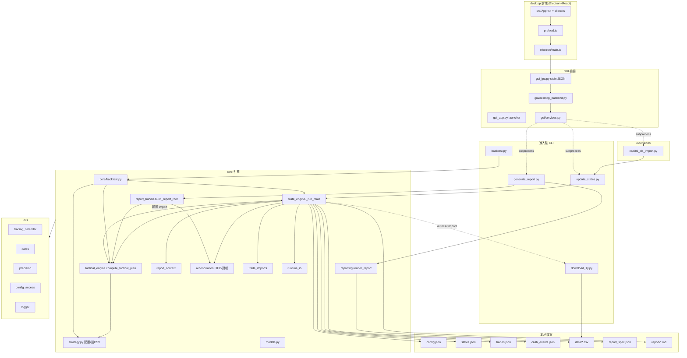
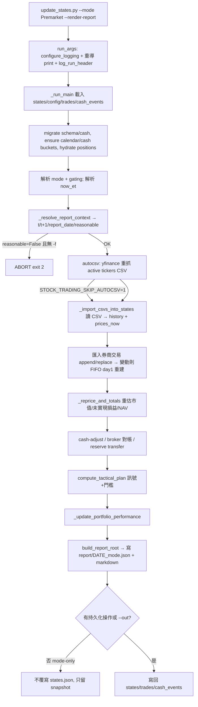
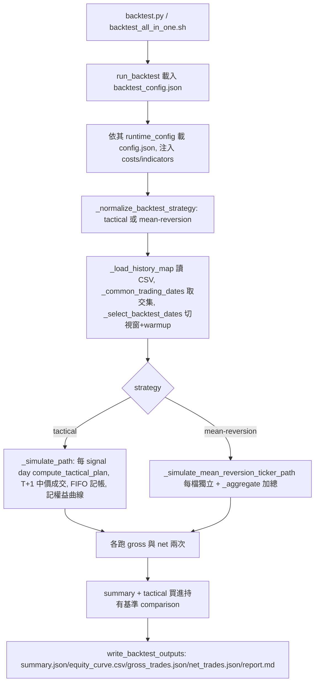
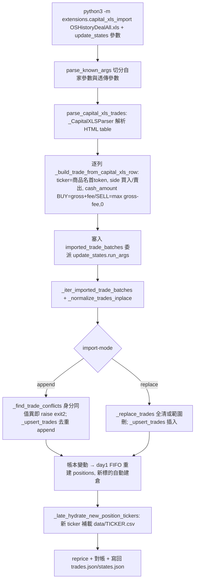
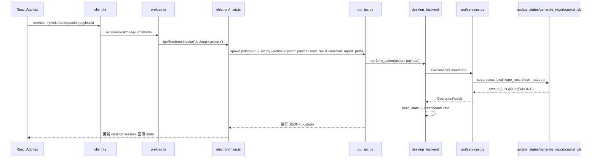

# dsxcai/stock_trading 技術研究文件

> **來源 repo**：https://github.com/dsxcai/stock_trading
> **研究日期**：2026-06-16
> **研究對象 commit**：`23470ca0941e9cf9cf5444ce4dbbc95c700ecc43`（2026-04-24，depth-1 clone）
> **研究方法**：8 路子系統並行深讀原始碼 → 綜合撰寫 → 關鍵主張對照原始碼抽查驗證（commit hash、P_min `/(window-1)` 公式、買賣訊號邏輯、預設 indicators、mode-only 不覆寫 states、numeric_precision 10 鍵驗證 — 皆與原始碼一致）
> **版本標記**：`desktop/package.json` = `1.3.1+pre`；CHANGELOG 基線 v1.0.0（2026-03-19）
> **作者 / 授權**：Sheng-Hsin Tsai / MIT License (Copyright © 2026)

---

## 1. 專案總覽

### 它是什麼

`stock_trading` 是一套**個人用、純本地、檔案式**的美股波段交易「決策＋記帳＋報告」系統。使用者身處台灣，透過**群益（Capital）證券複委託**操作以 USD 計價的美股 ETF / 個股，本系統幫他：

1. 每天依據趨勢規則算出**買 / 賣 / 加碼 / 持有**的隔日（t+1）動作建議；
2. 把群益的成交紀錄匯入、用 **FIFO** 重建持倉與成本基礎；
3. 管理 USD 現金（可部署 / 保留兩桶、存提款、券商對帳）；
4. 產出一份含五張表的 **Markdown 投資日報**；
5. 用歷史 OHLCV **回測**兩種策略；
6. 提供一個 **Electron 桌面 GUI** 讓上述操作不必碰 CLI。

### 解決什麼問題

- **複委託對帳麻煩**：群益匯出的 `OSHistoryDealAll.xls`（實為 HTML table）需要被解析成標準化交易並併入帳本。
- **跨時區語意混亂**：台灣使用者要對美股的盤前 / 盤中 / 盤後（ET 時區）做出正確口徑的訊號，系統用 `mode × ET session × NYSE 交易日曆` 自動推導 t / t+1。
- **線上與回測一致性**：訊號邏輯（`compute_tactical_plan`）線上與回測**共用同一份程式碼**，避免回測過度樂觀。
- **報酬率失真**：存提款只調整資本基底（`baseline`）而非抹除既有損益，入金不會把報酬率稀釋成假跌。

### 目標使用者

單一個人投資者（作者本人風格）。一人、本地、長期使用；GUI 設計成桌面單機應用。

### 核心特性

| 面向 | 特性 |
|---|---|
| 決策 | tactical 波段訊號（MA 上穿 + 5 日動能）、t+1 動作建議、P_min 觸發門檻表 |
| 記帳 | FIFO 持倉重建、含費用現金口徑、append-only 現金帳本 |
| 現金 | deployable / reserve 兩桶模型、券商現金/持倉對帳 |
| 報告 | schema 驅動（`report_spec.json`）五張表 Markdown、USD/TWD 雙幣別 |
| 回測 | tactical + mean-reversion 兩策略、gross/net 雙路徑、買進持有基準 |
| 操作 | Electron 桌面 GUI（取代舊 HTTP GUI）、CLI |
| 品質 | golden fixture 端到端回歸、Keep-a-Changelog + semver |

### 技術棧

- **核心引擎**：Python 3（標準庫 + `yfinance` 抓行情、`pandas` 處理 CSV、`exchange_calendars` 為交易日曆 fallback）。
- **桌面 GUI**：React + TypeScript + Vite + Electron。
- **儲存模型**：**純本地檔案，無資料庫、無雲端**。狀態散在 `config.json` / `states.json` / `trades.json` / `cash_events.json` / `data/*.csv` / `report/*.md`。`states.json` 被刻意設計成「可丟棄的衍生快取」——真相在 `trades.json + cash_events.json + data/*.csv + config.json`。

> **單位約定（重要，與作者其他台股專案不同）**：本系統 **shares 為整數「股」（無「張」概念）**、**價格與現金皆為 USD 浮點數（無 ×10000 縮放、無整數定點元）**，精度由 `config.json` 的 `numeric_precision` 十個鍵集中控制。請勿套用 tw-day-trading 的「價格×10000、現金整數元」慣例。

---

## 2. 系統架構

### 分層

```
進入點 (CLI)         update_states.py / generate_report.py / backtest.py / download_1y.py
extensions          capital_xls_import.py  (群益 XLS → normalized trades 的前置轉換層)
core 引擎           state_engine(主管線) / tactical_engine / strategy / backtest /
                    reporting / report_bundle / report_context / report_meta /
                    report_output / reconciliation / trade_imports / runtime_io / models
utils               dates / trading_calendar / logger / parsers / config_access / precision
gui 橋接            gui_app.py(launcher) / gui_ipc.py(stdin JSON 橋) /
                    gui/services.py(業務核心) / gui/desktop_backend.py(動作路由)
desktop 前端        Electron main.ts/preload.ts + React App.tsx + api/client.ts (TS)
共享檔案            config.json / states.json / trades.json / cash_events.json /
                    data/*.csv / report/*.md(+json) / report_spec.json / logs/
```

設計核心：**`update_states.py` 與 `generate_report.py` 是薄殼**，真正的每日 pipeline 主體在 `core/state_engine.py:_run_main`。GUI 不另存狀態，只是透過 subprocess 呼叫同一批 CLI，與 CLI 完全共用本地檔。

### 模組關係圖



> **雙向依賴注意**：`tactical_engine ↔ state_engine` 互相 import，靠**函式內延遲 import** 化解循環。

---

## 3. 核心概念與資料模型

### 四檔職責切分

| 檔案 | 角色 | 內容 | 持久化策略 |
|---|---|---|---|
| `config.json` | 設定（唯一可信設定源） | `state_engine` 子樹：meta / execution（費率）/ portfolio（buckets）/ strategy（tactical.indicators）/ data（fx_pairs, csv_sources）/ reporting（numeric_precision）/ trading_calendar / gui | 使用者維護，整檔重寫（GUI Runtime Config）或局部更新（Signal Config） |
| `states.json` | 壓縮核心狀態 | `_compact_persistent_states` 後只留 positions `{ticker, shares}`（shares 轉 int）與 cash `usd`、`baseline_usd` | **破壞性精簡**：剝除 market/totals/signals/thresholds/cost_usd/performance 衍生欄；可隨時由 trades 重建 |
| `trades.json` | 逐筆交易帳本（**真相來源**） | normalized TradeRecord：trade_date_et / time_tw / ticker / side / shares / gross / fee / cash_amount / trade_id | append-only 性質，去重靠自然鍵；`_compact_trade_row` 精簡寫回 |
| `cash_events.json` | append-only 現金帳本 | CashEventRecord：event_id（`cash-00001`）/ kind / amount_usd（恆正）/ cash_effect_usd（帶號）/ bucket_from/to / ts_utc | 只增不改；舊版內嵌帳會自動 migrate 進來 |
| `report/<DATE>_<mode>.json` + `.md` | 報表快照 | render root 序列化 + Markdown 日報 | 每次渲染重生 |

> `states.json` 不存成本基礎；FIFO 成本每次 runtime 由 `trades.json` day-1 全量重算。因此 **`states.json` 不可單獨當帳本**。

### mode（盤前/盤中/盤後）如何運作

mode 由 `_resolve_report_context`（`report_context.py`）在執行期即時推導，**不持久化**。它把 `(mode, now_et)` 對應到 `t_et / t_plus_1_et / report_date / snapshot_kind / reasonable`。

`_session_class_for_now_et` 先判斷 ET 當下的 session：

| 條件 | session |
|---|---|
| 非 NYSE 交易日 | `closed` |
| < 09:30 ET | `premarket` |
| < 收盤（預設 16:00 ET；early_close 日讀日曆 close_time_et） | `intraday` |
| 其餘 | `afterclose` |

接著各 mode 的 t / 合理性：

| mode | t_et | t+1 | reasonable=True 的條件 | Price(Now)=A 口徑 |
|---|---|---|---|---|
| Premarket | 前一交易日 | 今日 | session=premarket | Close(t)（前一收盤） |
| Intraday | 今日 | 下一交易日 | session=intraday | 當日盤中現價（標 Estimated Price） |
| AfterClose | 今日 | 下一交易日 | session=afterclose | Close(t)（今日收盤） |

`reasonable=False`（如盤中跑 premarket）會 `[ABORT] exit 2`，須加 `-f/--force-mode` 才放行（改印 `[WARN]` 續跑）。

> **陷阱**：mode-only 執行（有 `--mode` 但無持久化操作且無 `--out`）**刻意不覆寫 `states.json`**，只輸出報表快照（`state_engine.py:1455-1457`）。要更新狀態必須帶交易/現金/初始投資等操作或 `--out`。

### 數值精度（硬性 schema）

`config.json` 的 `state_engine.reporting.numeric_precision` **必須定義全部十個鍵**，缺一即 `KeyError`，非負整數否則 `ValueError`：

`usd_amount`、`display_price`、`display_pct`、`trade_cash_amount`、`trade_dedupe_amount`、`state_selected_fields`、`backtest_amount`、`backtest_price`、`backtest_rate`、`backtest_cost_param`（即使不跑回測也要齊）。

### FIFO 持倉

- `_rebuild_portfolio_positions_from_day1_fifo`：按 `(trade_date_et, time_tw, trade_id)` 排序，逐筆套用。BUY → append lot `{shares, unit_cost_usd = total_cost/shares}`；SELL → 由 `lots[0]` 起消耗（1e-12 容差）。
- 買入成本來源優先序（`_trade_buy_total_cost_usd`）：`cash_amount → amount → gross+fee`。
- **賣超**：賣出量 > 持有量時清空 lots 並印 `[WARN] clamp to zero`（不報錯，可能掩蓋漏匯入的 BUY）。
- 主流程交易匯入後**一律走 day-1 全量重建**（保留逐批 lot）；`_apply_incremental_trades_to_portfolio_fifo`（增量版）會把整檔攤成單一均價 lot、丟失逐批進價，主流程不走此路徑。

### 現金兩桶模型

不變式恆成立：`cash.usd = deployable_usd + reserve_usd`

| 桶 | 用途 | 是否計入 NAV |
|---|---|---|
| `deployable_usd` | 可拿來買股（買進預算唯一來源） | ✅ |
| `reserve_usd` | 刻意排除於下一輪買進的保留金 | ✅（仍計入總資產） |

`_ensure_cash_buckets` 在每次 run 開頭與每個改現金的函式入口修復不變式（缺欄補齊、皆夾非負、按 `usd_amount` 精度 round）。`baseline_usd` 是資本基底，存提款改它而非直接改 `usd`。

---

## 4. 策略與訊號邏輯

主入口 `compute_tactical_plan`（`core/tactical_engine.py:52`），對 config 中每檔 tactical 標的計算訊號，**純函式、不寫持久化狀態**（`apply_tactical_plan` 才寫回 transient 區）。預設指標：`{GOOG:SMA50, SMH:SMA100, NVDA:SMA50}`。

### 訊號計算（三個變數 A/B/C）

設升冪歷史收盤序列 `closes`（已用 `_history_rows_on_or_before` 截到 ≤ t，防 look-ahead）：

| 符號 | 定義 | 推導（`_derive_signals_inputs_from_history`） |
|---|---|---|
| **A** = `close_t` | 訊號基準日 t 的收盤（口徑隨 mode 變） | `closes[-1]` |
| **B** = `ma_t` | 最後 `window` 根收盤的 SMA | window 充足時取算術平均 |
| **C** = `close_t_minus_5` | 相對 t 往前 5 個交易日的收盤 | `closes[-6]`（需 ≥6 列，否則 None） |

### 買 / 賣 / 加碼規則

```
a_gt_b      = (A > B)                        # 收盤 > 移動平均（多頭濾網 1）
a_gt_c      = (A > C)                        # 收盤 > 5 日前收盤（動能濾網 2）
buy_signal  = a_gt_b AND a_gt_c             # 兩濾網都過才是買進候選
shares_pre  = 該標的 tactical 持股（bucket=tactical/tactical_cash_pool）
sell_signal = (NOT buy_signal) AND shares_pre > 0
```

t+1 動作判定（優先序，`tactical_engine.py:103-208`）：

| 條件 | t+1_action | 股數 |
|---|---|---|
| `sell_signal` | **SELL_ALL** | 全數出清 `shares_pre`（不支援分批/減碼） |
| `buy_signal` 且已持有且配到股 | **BUY_MORE** | 配得股數 |
| `buy_signal` 且未持有且配到股 | **BUY** | 配得股數 |
| `buy_signal` 且已持有但配 0 股 | **HOLD** | 0 |
| `buy_signal` 且未持有但預算不足 | **BUY** | **0**（「該買沒錢」，非無訊號） |
| 其他 | **NO_ACTION** | 0 |

> 加碼規則：只要 `buy_signal` 有效就參與當輪配股，不論是否已持有。

### t+1 假設觸發收盤門檻 P_min

「隔日收盤要漲到多少才會在 t+1 觸發買進」（`_calc_threshold_row`，`strategy.py:137`）：

```
threshold_from_ma        = ma_sum_prev / (window - 1)      # 注意是 /(window-1)
threshold_from_t_minus_5 = close_t_minus_5_next
P_min                    = max(threshold_from_ma, threshold_from_t_minus_5)   # strict >
display                  = round(P_min, display_price) + "+"
```

- `ma_sum_prev` = 最後 `(window-1)` 根收盤之和（`_derive_threshold_inputs_from_history`，需 ≥window-1 列）。
- **為何是 `/(window-1)`？** 求「下一收盤 x 使新 SMA(window)=x 的等值臨界值」時，x 同時是新樣本也進分母，代數化簡後臨界值恰為「固定 window-1 根之和 / (window-1)」。
- **索引陷阱**：訊號用 `closes[-6]`（站在 t 看 5 天前），門檻用 `close_t_minus_5_next = closes[-5]`（站在 t+1 視角，t+1 時的 t-5 收盤即現在的 `closes[-5]`）。premarket 只有 5 列時訊號的 C 為 None（a_gt_c=False/缺值）。

### 費用感知定價

| 函式 | 公式 | 用途 |
|---|---|---|
| `_buy_sizing_price_usd` | `price × (1 + buy_fee_rate)` | 配股估算避免超買 |
| `_sell_reclaim_price_usd` | `price × max(1 - sell_fee_rate, 0)` | 估算賣出回收併入買進預算 |

`price <= 0` 回 `None`（該標的不納入）。

### 線上 vs 回測一致性

回測（`core/backtest.py`）直接 import 並重用同一支 `compute_tactical_plan`：t 收盤產訊號、t+1 以 `(Open+Close)/2` 中價成交（`_t_plus_1_mid`），確保規則一致。

> **已知限制**：`_normalize_ma_rule` 雖讀 `ma_type`（預設 SMA），但實際計算只實作 SMA；指定 EMA/WMA 時 window 仍生效但仍以算術平均計算。`_parse_indicator_window` 只抓字串中的數字（`SMA50`→50）。

---

## 5. 現金分桶與股數配置

### 現金事件（CashEventRecord）

`kind ∈ {deposit, withdrawal, to_reserve, to_deployable}`。`amount_usd` 永遠為正，方向只在 `cash_effect_usd`（存款＋ / 提款− / 內部轉移 0）與 `bucket_from/to`。

### 現金操作（`_run_main` 固定執行順序）

```
initial_investment → cash_adjust → 券商持倉對帳
→ _update_tactical_cash_from_trades_and_snapshot（現金落地）
→ cash_transfer_to_reserve（越界即 SystemExit(2)，全程不落地）
```

| 操作 | 函式 | 行為 |
|---|---|---|
| 外部存提款 | `_apply_cash_adjustment` | **只改 `baseline_usd`**（+= amt），記 deposit/withdrawal 事件；實際 `usd` 由後續步驟重算 |
| 桶間轉移 | `_apply_cash_transfer_to_reserve` | 正值 deployable→reserve、負值反向；總額不變（effect=0）；越界（容差 1e-9）raise ValueError |
| 現金落地 | `_update_tactical_cash_from_trades_and_snapshot` | `cash.usd = baseline_usd + 交易淨現金`；可對帳券商現金（diff > tolerance → MISMATCH 但不中止）；經 `_set_total_cash_preserve_reserve` 保住 reserve |
| 交易淨流 | `_net_cash_change_from_trades` | side `B*`→net−=cash_amount、`S*`→net+=cash_amount；可帶 cutoff（盤中只計截止前成交） |

> **隱性順序耦合**：`_apply_cash_adjustment` 不直接改 `cash.usd`，靠後續落地步驟重算。若落地步驟未跑，存提款不會反映到 `cash.usd`。

### 買進股數配置（三階段貪婪，`_allocate_buy_shares_across_triggered_signals`）

**預算** = `deployable_usd`（缺 None 才退回 `cash.usd`，皆 max(.,0)）+ `estimated_sell_reclaim_usd`（同輪 SELL_ALL 的預估回收 `Σ sell_reclaim_price × shares_pre`）。

前置：清洗（ticker 非空、price>0）→ 依（含費單價, 代號）升冪排序 → epsilon=1e-9 容差。連最便宜 1 股都買不起 → 全 0。

| 階段 | 動作 |
|---|---|
| **A** | 預算夠每檔各 1 股 → 全選；否則由便宜到貴取「最便宜可負擔前綴集合」各給 1 股 |
| **B** | 剩餘預算平均分到已選標的（remaining/len），各自整除單價加股（向下取整） |
| **C** | 用剩餘現金反覆買「買得起的最貴」標的各 1 股，直到無人可負擔 |

回傳 `{ticker: 整數股數}`。配股以含費單價計算，全為整數股（複委託無零股）。

> `deployable_usd=0.0`（非 None）→ 預算就是 0，候選全配 0 股；`0` 與 `None` 行為不同。
> 線上版只用含費單價估算，**不像回測逐股用 `_max_affordable_buy_shares` 再驗**；fee 估計與券商實際差異大時理論上可能略超 deployable，倚賴人工/次日對帳把關。

---

## 6. 主要流程

### (a) 每日 mode 流程（以 Premarket 為例）



Intraday/AfterClose 差別只在 `t` 與定價口徑（見 §3 表）。autocsv 只在帶 `--mode` 時跑；`STOCK_TRADING_SKIP_AUTOCSV=1` 完全停用（測試/重現用）。

### (b) 報告產生流程（`generate_report.py`）

```mermaid
flowchart LR
  A[generate_report.py --states --config --mode --date] --> B[載入四檔, migrate, cash buckets, hydrate]
  B --> C[_resolve_runtime_report_meta: now_et+date+mode → signal_basis/execution_basis]
  C --> D[匯入 CSV persist_market_snapshot=False 不寫回]
  D --> E[_reprice_and_totals + _update_portfolio_performance]
  E --> F[compute_tactical_plan 取 signals/thresholds 不寫回]
  F --> G[build_report_root 注入 config/trades/cash_events/activities/TWD/估價註記到暫態 root]
  G --> H[render_report 讀 report_spec.json → 五張表 Markdown]
  H --> I[寫 YYYY-MM-DD_mode.md]
```



核心原則：**持久化狀態 report-agnostic**——`build_report_root` 對 states 做淺拷貝後注入報告專屬資料，**絕不寫回 `states.json`**。

### (c) 回測流程（`backtest.py`）



### (d) 群益 XLS 匯入 / 初始化流程



替代初始化路徑：`update_states.py --imported-trades-json <json> --trades-import-mode replace`，跳過群益解析、從 normalized JSON bootstrap。

---

## 7. 報告系統

報告由 `report_spec.json`（v1.3.0，宣告式 schema，外覆 ```json 圍欄）驅動。渲染引擎 `core/reporting.py` 支援 `eval_expr` 迷你運算式（`const/path/gt/div/sub/if/map`；`div` 遇分母 0 或 None 回 None → 顯示 `-`）。組裝在 `core/report_bundle.py:build_report_root`。

報表表頭：Generated At / Version / Signal Basis(t) / Execution Basis(t+1) / price_notes / Nearby Trading Calendar。`render_report` 在三個 basis 全缺時才丟 `ValueError('mode snapshot not found')`。

### 五張表與關鍵欄位計算

| 表 | 重要欄位 | 計算方式 |
|---|---|---|
| **Performance Summary** | NAV、Total Assets、Profit、Profit Rate | `nav = 持倉市值 + cash_usd`；`effective_capital_base = initial_investment + net_external_cash_flow`；`profit = nav − base`；`profit_rate = profit/base`（無 initial_investment 則略） |
| **Current Positions** | Market Value、Unrealized P&L (USD/TWD)、Notes | `mv = shares × price_now`；`pnl = mv − cost`；grand_total 用 `nav_usd`（含現金），小計用 `holdings_mv_usd`（純持倉） |
| **Signal Status** | A>B、A>C、Buy Signal、t+1 action、建議股數 | 見 §4；排序鍵 `sub(ma_t − close_t)=B−A` 降冪（最深跌破均線者最上），同值 ticker 升冪 |
| **t+1 P_min 門檻表** | SMA 門檻、P_min、display `值+` | `max(ma_sum_prev/(window-1), close_t_minus_5_next)`，strict >；排除 tactical cash pool ticker |
| **Trade Details** | Buy Basis、Realized P&L、CASH 活動 | 見下 |

### Trade Details 細節

- **Buy Basis**（`_sell_realized_by_trade_id`，獨立第二遍 FIFO）：對每個 SELL 按 ticker 買進批次先進先出配對，得加權平均每股成本。
- **Realized P&L** = `_trade_cash_effect`（扣賣費後正值）− FIFO 配對成本（含買入費）= **真正含雙邊費用的已實現損益**，非單純 `(賣價−買價)×股數`。
- 存提款被轉成 `ticker=CASH` 的 DEPOSIT/WITHDRAWAL 活動列。
- **分組**：依 `trade_date_et` 降冪分組；最新 1 組用 full 欄位集（含 Realized P&L），往前 N 組（`keep_prev_trade_days_simplified` 預設 5）用 simple 欄位集；各組附 footer 加總。simple 組無 Realized P&L 欄。

### TWD 換算（`_position_twd_metrics`）

- 市值 TWD = `market_value_usd × 報告日（含）當天匯率`。
- 成本 TWD = `Σ(各 FIFO 批次股數 × 每股 USD 成本 × 該批進場日匯率)`——刻意分別取匯率以反映持有期間匯率變動。
- **任一批次匯率缺失即整檔回 None**，該 bucket TWD 小計留空（避免誤導加總）。匯率來源是 config 的 `usd_twd` fx pair 對應 CSV。

### 報酬率語意

存提款調整 base 而不計入 profit，故入金後報酬率不會被稀釋成假跌、出金不會假漲。

---

## 8. 回測引擎

`core/backtest.py`（單檔約 1624 行）支援兩策略，各跑 **gross（不含成本）與 net（含成本）兩條完全獨立的模擬**（成交序列可能因可負擔股數不同而分歧）。

### 兩策略

| 策略 | 進場 | 出場 | 基準 |
|---|---|---|---|
| **tactical** | 沿用線上：`close>MA` 且 `close>close_{t-5}` | buy_signal 失效 → SELL_ALL | 「首日買進並持有不賣」買進持有基準 + 超額報酬 |
| **mean-reversion** | 空手且 `close(T)/anchor − 1 ≤ −entry_drawdown` → 全力買進 | 停損先於停利：`close/entry−1 ≤ −stop_loss`→STOP_LOSS；否則 `close/anchor−1 ≥ take_profit`→TAKE_PROFIT，皆全出 | 無基準區塊 |

mean-reversion：`anchor` 為 day0 收盤，每次實際成交後 anchor 重設為成交日 T+1 收盤；統計勝率（realized>0 回合/完成回合）、TP/SL 次數；各 ticker 獨立後 `_aggregate_mean_reversion_path` 加總。take_profit 以 anchor 為基準、stop_loss 以 entry_price 為基準。

### 成本模型（`BacktestCostModel`，三欄）

| 欄位 | 意義 | 套用 |
|---|---|---|
| `fee_rate` | 比例手續費（0.002=0.2%） | `_trade_fee = gross×fee_rate + commission` |
| `commission_per_trade` | 每筆固定 USD | 同上；`_max_affordable_buy_shares` 先預扣一筆再地板除 |
| `slippage_bps` | 基點滑價（2.0=0.02%，需 /10000） | 買單 `mid×(1+bps/10000)`、賣單 `×(1−bps/10000)` |

### 關鍵設計

- **T+1 中價成交**：訊號在 T 收盤產生，成交價 `(Open(T+1)+Close(T+1))/2`，避前視偏誤。
- `_warmup_bars = max(6, 最大指標視窗)`；tactical 共同交易日 < 7 直接 ValueError。
- 回測視窗：`--lookback-trading-days`（預設 252）或 `--start-date/--end-date`，自動往前保留 warmup。
- `_make_trade_row` 買/賣時間戳 `22:30:01 / 22:30:00`，讓同日賣出排在買進前（先賣後買，回收可同日再投）。
- 共用線上記帳：tactical 路徑 `from core import state_engine as live_runtime`，並把 `live_runtime.print` 換成 no-op 靜音。

### 輸入輸出

- 輸入：`backtest_config.json` + 其指向的 `config.json` + `data/*.csv`。
- 輸出五檔：`summary.json`、`equity_curve.csv`（tactical 多 core/tactical/buy_and_hold 欄）、`gross_trades.json`、`net_trades.json`、`report.md`。

mean-reversion 參數：`entry_drawdown/take_profit/stop_loss` 經 `_pct_value` 強制落在 (0,1) 開區間（預設 0.02/0.02/0.07），CLI `--mr-*` 旗標僅在值>0 才覆寫。

---

## 9. GUI 與桌面應用

### 架構：stateless Python + Electron 持有 session

舊版本地 HTTP GUI 已移除。新架構是「**一次性 spawn Python 子行程 + JSON over stdin/stdout**」：每次 IPC 都是全新短命 Python 行程，沒有常駐後端。



> Python 端完全無狀態：`selected_report_path` 與 `last_result` 由 Electron 記憶體 `desktopSession` 保存，每次 spawn 時連同 payload 寫進 stdin。協議是**單行 JSON**（`readline()` 一行），任何寫到 stdout 的非 JSON 雜訊都會破壞 `JSON.parse`。

### GuiServices 主要動作

| 方法 | 行為 |
|---|---|
| `run_report` | 歷史日 → `generate_report.py --date`（拒 intraday）；最新場次 → `update_states.py --render-report` |
| `run_import_trades` | `python -m extensions.capital_xls_import`，預設 replace，可限 ET 區間；成功後 refresh 報告 |
| `run_cash_adjustment` | `update_states.py --cash-adjust-usd`（`format(v,'g')` 避科學記號），正入金/負出金 |
| `save_runtime_config` | **整檔重寫** config（保留既有 indicators 與 gui 區塊；其他自訂欄位會遺失） |
| `save_signal_config` | 局部更新 `strategy.tactical.indicators`，SMA window 僅允許 50/100，至少留 1 ticker |
| `check_environment` / `init_clean_environment` | 健檢四檔；init 只補 missing/invalid |
| `export_zip` / `import_zip` | 備援四檔 + report_spec.json；import 用白名單防路徑穿越 |
| `delete_report` / `delete_all_reports` | 報告名硬規則 `YYYY-MM-DD_(premarket\|intraday\|afterclose).md`，連同 .json 一起刪 |

### 桌面分頁與 Data Management

- 左控制軌：Generate Report / Import Trades / Cash Adjustment / Recent Reports。
- 右工作區：**Report**（react-markdown 渲染）/ **Status**（OperationResult：成敗 pill、command、exit code、log）/ **Config**（Runtime Config + Signal Config + 底部 Data Management）。
- Data Management：健檢、Initialize Clean Environment、Export/Import Data Zip。
- 首次啟動引導：資料檔 missing/invalid 時顯示 setup 畫面。
- Reload 機制：main.ts 寫 `.restart_flag` 後 quit，`gui_app.py` 迴圈偵測旗標重啟。
- 假進度條：`PROGRESS_PROFILES` 純前端啟發式三次方緩動，上限 95%，與真實進度無關。

### 前端技術棧

React + TypeScript + Vite（`base: './'` 供 Electron `loadFile`）+ Electron（`contextIsolation:true`、`nodeIntegration:false`，renderer 只能透過 preload 白名單）。`gui_app.py` 自動 `npm install`、build 過期偵測（比較 dist mtime）、`PYTHON=sys.executable` 傳給 Electron 讓 spawn 的 python 一致。

---

## 10. 匯入與對帳

### 群益 XLS 匯入

群益的 `.xls` 實為 **HTML `<table>`**，用 `html.parser`（`_CapitalXLSParser`）純文字解析，不依賴 openpyxl/pandas。必要 9 個中文欄位（商品名稱/交易日/買賣別/成交單價/成交股數·單位數/成交價金/成交時間/原幣手續費/原幣淨收付），缺欄即 ValueError。

| 欄位轉換 | 規則 |
|---|---|
| ticker | 商品名稱第一個 token 大寫（`NVDA 輝達`→`NVDA`） |
| side | `買入`→BUY、`賣出`→SELL；其他（如現股當沖）raise |
| shares | 四捨五入成整數股 |
| **cash_amount**（全包現金影響） | BUY = `成交價金 + 手續費`；SELL = `max(成交價金 − 手續費, 0)` |

`參考匯率/台幣淨收付/前手息` 等欄被完全忽略（TWD 換算由報告層用 CSV 的 FX 收盤另算）。

### 匯入模式與去重

| 模式 | 行為 |
|---|---|
| **append** | `_find_trade_conflicts`：身分鍵 `(date,time,ticker,side)` 相同但 `_trade_key`（含 shares/gross/fee）不同 → 衝突 → `exit 2` 不寫檔；否則 `_upsert_trades` 去重 append（重跑同份 XLS 不重複） |
| **replace** | `_replace_trades`：無範圍清空整本；有 `--trade-date-from/to` 刪該 ET 區間（界限以正規化後 YYYY-MM-DD 字串比較）；再插入 |

去重精度：`trade_cash_amount`（存檔 cash_amount 小數位）、`trade_dedupe_amount`（去重鍵 gross/fee 格式化位數）。修改既有交易的 shares/gross/fee **不能用 append 覆寫**（會被當衝突中止），正確做法是 replace。

### 新標的自動建倉與晚期 hydration

XLS/JSON 帶進尚未存在的 ticker 時自動建 position（bucket 依 config core/tactical 名單判定，預設 tactical）。`_late_hydrate_new_position_tickers` 從 `./data/<TICKER>.csv` 補載 OHLC，同一次執行內完成 reprice 與未實現損益重算（免二次執行）。

### 對帳機制（**只回報、不中止**）

| 對帳 | 旗標 | 行為 |
|---|---|---|
| 券商持倉 | `--broker-investment-total-usd` + `-kind`（cost_basis / market_value） | 與投組總額（**硬寫死排除現金**）相減，`|diff| ≤ verify_tolerance_usd`（預設 1.0 USD）→ OK，否則 MISMATCH，寫 `portfolio.broker.reconciliation` |
| 券商現金 | `--tactical-cash-usd` | 對帳 tactical cash baseline，反推新 baseline |

MISMATCH 只印 `[MISMATCH]`、仍寫檔回傳 0；相對地 append 衝突與越界轉帳會 `SystemExit(2)`。

---

## 11. 進入點與 CLI 速查表

### update_states.py（每日主管線，薄殼）

| 指令 | 說明 |
|---|---|
| `python3 update_states.py --mode Premarket --render-report` | 盤前模式產報告（mode-only 不覆寫 states） |
| `python3 update_states.py --mode AfterClose --render-report --out states.json` | 盤後並更新狀態 |
| `python3 update_states.py --imported-trades-json t.json --trades-import-mode replace` | 從 normalized JSON bootstrap（可無 --mode） |
| `python3 update_states.py --cash-adjust-usd 1000 --cash-adjust-note "入金"` | 記外部存款（正入/負出，無 --mode） |
| `python3 update_states.py --cash-transfer-to-reserve-usd 500` | deployable→reserve 轉移（負值反向） |
| `python3 update_states.py --initial-investment-usd 50000` | 設初始投入 |
| `python3 update_states.py --mode AfterClose --broker-investment-total-usd 60000 --broker-investment-total-kind cost_basis` | 券商持倉對帳 |
| `... --mode X --force-mode` (`-f`) | session 不符時強制執行 |
| `... --allow-incomplete-csv-rows` | 容忍缺漏 CSV 列 |

關鍵旗標群：輸入（`--states/--config/--trades-file/--cash-events-file/--csv-dir`）、模式（`--mode/--now-et/-f`）、報表（`--render-report/--report-dir/--report-out`）、交易匯入（`--imported-trades-json` 可重複 / `--trades-import-mode append|replace` / `--trade-date-from|to`）、衍生（`--derive-signals-inputs/--derive-threshold-inputs` 各 missing|force|never）。

### generate_report.py（純報告，不污染 states）

| 指令 | 說明 |
|---|---|
| `python3 generate_report.py --states states.json --config config.json --mode AfterClose` | 產當前報告 |
| `python3 generate_report.py ... --mode Premarket --date 2026-03-18` | 指定歷史交易日（拒 intraday） |
| `... --csv-dir data --now-et 2026-03-18T08:00:00-04:00` | 覆寫行情目錄與當下 ET |

### backtest.py（回測）

| 指令 | 說明 |
|---|---|
| `python3 backtest.py --strategy tactical --lookback-trading-days 252 --out-dir out` | tactical 回測（gross+net） |
| `python3 backtest.py --strategy mean-reversion --mr-entry 0.02 --mr-tp 0.02 --mr-sl 0.07` | 均值回歸並覆寫參數 |
| `python3 backtest.py --start-date 2024-01-01 --end-date 2025-01-01 --starting-cash 100000` | 明確區間與起始資金 |
| `bash backtest_all_in_one.sh` | 一鍵（自動時間戳 out-dir + 五檔輸出） |

### download_1y.py（行情下載）

| 指令 | 說明 |
|---|---|
| `python3 download_1y.py --config config.json --days-back 370 --end 2026-03-18` | 依 config ticker 清單下載 |
| `python3 download_1y.py --tickers GOOG SMH NVDA TWD=X --zip` | 指定 ticker 並打包 zip |
| `python3 download_1y.py --days-back 1200 --end $(date +%Y-%m-%d) --zip` | 等價舊 `get_rec.sh` |
| `... --allow-incomplete-csv-rows` | 容忍缺值列（否則 fail-fast） |

---

## 12. 測試與品質

### 測試套件

`bash run_tests.sh` → `python3 -m unittest discover -s tests -v`。README 宣稱 12 檔 / ~156 tests，涵蓋 pipeline / report / 訊號 / 匯入 / 現金 / 對帳 / GUI / backtest / 下載工具。多數測試需 pandas；`LiveDataSmokeTests` 缺 live 檔時自動 skip。

權威行為規格檔：

| 測試檔 | 鎖定行為 |
|---|---|
| `test_state_engine_signals.py` | SELL_ALL、加碼配股含費用、賣出回收併入預算、close_t_minus_5 索引、預算不足仍渲染 BUY 0 |
| `test_regression_pipeline.py` | 端到端 golden 逐字元比對、force-mode session 檢查、yfinance outage 容忍 |
| `test_strategy_and_download.py` | 門檻計算、配股、`_read_ohlcv_csv` 去重/不完整列、frame 攤平 |
| `test_capital_xls_import.py` | 群益 20 欄真實格式、append 去重/replace/日期範圍/衝突中止 |
| `test_gui_services.py` / `test_gui_import_trade_date_range.py` | GUI 動作與匯入區間 |

### golden fixture 回歸機制

- `test_regression_pipeline.py` 把專案複製到**臨時目錄**（避免污染 repo），覆寫凍結 `tests/fixtures/test_config.json`，跑 Premarket pipeline 與 generate_report，與 `golden_premarket_states.json` / `golden_premarket_report.md` 逐字元比對。
- **deterministic 關鍵**：`STOCK_TRADING_SKIP_AUTOCSV=1`（停用 yfinance 抓網路）。忘了設會因抓到不同資料而 flaky。
- `refresh_test_fixtures.sh`：一鍵重生 golden（凍結輸入 + 跳過 autocsv，預設 `now-et=2026-03-18T08:00:00-04:00`），idempotent。改了訊號/精度/report_spec/資料結構就必須重生 golden，否則比對 fail。
- `is_yfinance_outage_tolerated`：僅在「非 NYSE 盤中」容忍 golden 比對失敗（亞洲清晨 yfinance 不穩），盤中嚴格當硬性 gate。

### 版本與 CHANGELOG 政策

- Keep-a-Changelog + semver；v1.0.0（2026-03-19）起任何功能/行為/輸出/測試基線變更都必須更新 `CHANGELOG.md`（與 README §17 提及的 `program.md`），且必須附對應測試。
- 舊版 shell 包裝（`premarket.sh`/`intraday.sh`/`afterclose.sh`/`get_rec.sh`/`zip_files.sh`）已在 v1.3.1 移除。

---

## 13. 目錄結構速覽

| 路徑 | 角色 | 行數量級 |
|---|---|---|
| `update_states.py` | 主 CLI 薄殼 | ~109 |
| `generate_report.py` | 報告 CLI orchestrator | ~153 |
| `backtest.py` | 回測 CLI 入口 | ~107 |
| `download_1y.py` | 行情下載器（被 autocsv 重用） | ~238 |
| `gui_app.py` / `gui_ipc.py` | GUI launcher / stdin JSON 橋 | ~153 / ~88 |
| `report_spec.json` | 宣告式報告 schema（v1.3.0） | ~395 |
| `backtest_config.json` | 回測設定 | ~21 |
| **core/** | | |
| `core/state_engine.py` | **每日 pipeline 主體**、FIFO、現金、對帳、寫回 | ~1471 |
| `core/backtest.py` | 回測引擎全部 | ~1624 |
| `core/tactical_engine.py` | `compute_tactical_plan` 訊號核心 | ~234 |
| `core/strategy.py` | 配股演算法、CSV 讀取、門檻計算 | ~272 |
| `core/reporting.py` | schema 驅動渲染引擎 | ~547 |
| `core/report_bundle.py` | `build_report_root` 暫態組裝 | ~667 |
| `core/report_context.py` | mode×session→t/t+1 推導 | ~273 |
| `core/reconciliation.py` | 交易正規化/去重/對帳/買入成本 | ~267 |
| `core/runtime_io.py` | JSON IO、compact 瘦身 | ~232 |
| `core/models.py` | dataclass 型別定義 | ~179 |
| `core/{report_meta,report_output,trade_imports}.py` | meta 合併 / 輸出路徑 / 匯入批次 | 小 |
| **utils/** | dates / trading_calendar / logger / parsers / config_access / precision | 各 ~60-140 |
| **extensions/** | `capital_xls_import.py`（群益 XLS） | ~188 |
| **gui/** | `services.py`（業務核心） / `desktop_backend.py`（路由） | ~1053 / ~224 |
| **desktop/** | `electron/main.ts`、`preload.ts`、`src/App.tsx`、`api/client.ts`、`types.ts` | TS 前端 |
| **tests/** | 12 測試檔 + `fixtures/`（golden + 11 支 ticker CSV 含 TWD=X） | |
| `run_tests.sh` / `refresh_test_fixtures.sh` / `backtest_all_in_one.sh` | shell 包裝 | 小 |
| `CHANGELOG.md` / `README.md` | 對外契約文件 | |

---

## 14. 快速理解導覽

### 建議閱讀順序

1. **`README.md`**（§3 每日四步、§4 買賣規則、§7 檔案職責、§9 訊號表）：理解業務語言與口徑。
2. **`core/models.py`**：先看 `SignalInputs / ThresholdInputs / TradeRecord / CashEventRecord / TacticalPlan / BacktestCostModel` 資料形狀，建立詞彙。
3. **`core/tactical_engine.py:compute_tactical_plan`（52-225）** + **`core/strategy.py`（108-272）**：訊號與配股是決策核心，且線上/回測共用，讀懂這裡等於讀懂一半系統。
4. **`core/state_engine.py:_run_main`（1172-1471）**：每日 pipeline 的真正主體，順著它看 migrate→FIFO→現金→reprice→訊號→寫回的全貌。
5. **`core/report_context.py:_resolve_report_context`**：搞懂 mode×session×日曆怎麼推 t/t+1（跨時區語意的關鍵）。
6. **`core/report_bundle.py` + `core/reporting.py` + `report_spec.json`**：報告怎麼組與渲染。
7. **`tests/test_state_engine_signals.py`** + **`tests/test_regression_pipeline.py`**：把行為規格當文件讀，最快確認邊界。
8. 想看回測：**`core/backtest.py:run_backtest / _simulate_path`**；想看 GUI：**`gui/services.py` → `desktop/electron/main.ts:invokePythonBridge`**。

### 與作者其他類似系統的差異提示

| 維度 | 本系統（stock_trading） | 對照（如 tw-day-trading 台股系統） |
|---|---|---|
| 市場 | 美股 ETF/個股，複委託、波段（非當沖） | 台股當沖 |
| 計價/單位 | **USD 浮點**、**整數「股」** | 價格×10000、數量用股（張=1000股）、現金整數元 |
| 儲存 | 純本地 JSON/CSV、無 DB、無雲端 | 有 DB |
| 介面 | **Electron 桌面 GUI** + CLI | 視專案而異 |
| 真相來源 | `trades.json + cash_events.json + data/*.csv`（states 可重建） | DB |

> **最大心智陷阱**：請把本系統的 `states.json` 當「可丟棄的衍生快取」、單位當「USD 浮點 + 整數股」。**不要**把台股專案的「價格×10000、現金整數元」慣例套到這裡。

### 已知開放問題（讀碼時留意）

- `_normalize_ma_rule` 讀 `ma_type` 但只實作 SMA，EMA/WMA 不會差異化計算。
- `estimated_sell_reclaim_usd` 用預估賣價併入同輪買進預算，無同輪硬上限，理論上可能短暫超買（倚賴次日對帳）。
- `_apply_cash_adjustment`（改 baseline）與 `_update_tactical_cash_from_trades_and_snapshot`（落地）有隱性順序耦合。
- `_compact_persistent_states` 似乎比 README 更激進地剝除 cash 細部（baseline/reserve 拆分可能遺失，下次靠 `_ensure_cash_buckets` 從 usd 重推）。
- `save_runtime_config` 整檔重寫會遺失 canonical 結構未涵蓋的自訂 config 欄位。
- 對帳 `broker_investment_total` 硬寫死「排除現金」；若券商總額含現金會系統性 MISMATCH。
- FIFO 賣超 clamp to zero 不報錯，可能掩蓋漏匯入的早期 BUY。