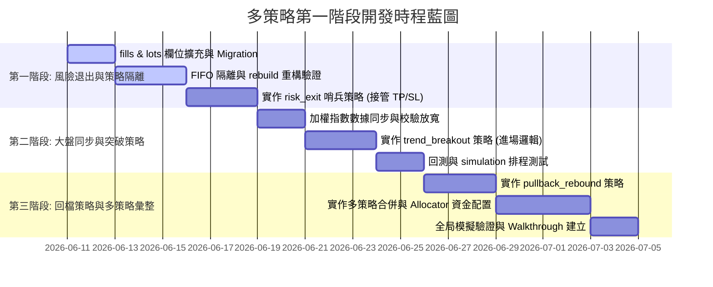

# 多策略架構設計與風險評估規劃書

本文件整理自台股波段量化交易系統 MVP 進入第一階段多策略並行開發時的**策略規格**、**潛在系統風險**與**架構解決方案**。

---

## 一、 第一階段三個核心策略規格

### 1. 趨勢帶量突破策略 (Trend Breakout)
* **定位**：主買入選股策略，捕捉主流、強勢、題材啟動股。
* **適合情境**：大盤多頭、族群輪動明確、成交量放大、強勢股創波段新高。
* **買入進場條件**：
  * **突破高點**：收盤價高於前 20 日最高收盤價（創 20 日新高）。
  * **帶量確認**：當日成交量大於 20 日均量的 1.5 倍（`volume[-1] > mean(volume[-21:-1]) * 1.5`）。
  * **個股多頭**：收盤價高於 60 日均線（`close > sma_60`）。
  * **大盤多頭**：加權指數高於 60 日均線（`index_close > index_sma_60`）。
* **退出條件**：由 **3. 持股風險退出策略** 統一接管。

### 2. 回檔轉強策略 (Pullback Rebound)
* **定位**：輔助買入選股策略，避免只追突破，補足強勢股拉回平台或均線支撐後再起攻的進場點。
* **適合情境**：個股處於中長線多頭結構，短線回檔至重要支撐，且出現轉強跡象。
* **買入進場條件**：
  * **趨勢偏多**：收盤價高於 60 日均線 且 20 日均線高於 60 日均線（`close > sma_60` 且 `sma_20 > sma_60`）。
  * **回測支撐**：當日最低價回踩月線附近（`low <= sma_20 * 1.02`）。
  * **K線轉強**：今日收紅 K 且收盤價高於昨日收盤（`close > open` 且 `close > previous_close`）。
* **退出條件**：由 **3. 持股風險退出策略** 統一接管。

### 3. 持股風險退出策略 (Risk Exit)
* **定位**：部位監控哨兵，專職出場與風險控制，不進行選股。
* **監控對象**：帳戶中所有非長期持有（`is_long_term = 0`）的策略持倉部位。
* **觸發退出條件**（任一滿足即產生 `SELL` 訊號）：
  * **固定停損**：收盤價跌破買入均價的 `-7%`（突破策略）或 `-5%`（回檔策略）。
  * **移動停利**：自持有後最高收盤價回落 `8%`。
  * **均線失效**：收盤價跌破 20 日均線。
  * **時間停損**：持有達 20 個交易日，但累計報酬未達 `+5%`。

---

## 二、 核心技術風險與解決方案

針對多策略並行與獨立退出機制，我們識別出以下 5 個架構風險，並提出對應的解法：

### 1. FIFO 帳務扣除與策略隔離衝突 (High Risk)
> [!CAUTION]
> **風險描述**：
> 當前 FIFO 撮合邏輯僅區分 `is_long_term`（隔離長線持股）。若策略 A（突破）與策略 B（回檔）同時持有 `2330`，策略 A 決定出場時，資料庫在 FIFO 計算時會直接扣掉帳戶中「最早買入」的 `2330` lot，這極可能扣到策略 B 的部位，導致策略間持倉互相污染、損益失真。

* **解決方案**：
  * **資料表升級**：在 `fills` 與 `position_lots` 資料表新增 `strategy_id` 欄位。
  * **FIFO 分組查詢**：修改 `PortfolioProjection._apply_fill_ops`，在執行 `SELL` 的 FIFO 扣除時，查詢條件必須限定為同一個 `strategy_id`：
    ```sql
    SELECT lot_id, quantity, price, fill_id FROM position_lots
    WHERE account_id = ? AND symbol = ? AND strategy_id = ? AND is_long_term = 0
    ORDER BY acquired_at ASC
    ```

### 2. 移動停利 (Trailing Stop) 數據遺失與重播風險 (Medium Risk)
> [!IMPORTANT]
> **風險描述**：
> 移動停利需要知道「買入後的歷史最高價」。若我們只在記憶體中追蹤，一旦重置模擬（Reset）或重新從 Ledger 建構投影（Rebuild Projections），該最高價就會丟失。如果動態從 `market_bars` 回溯查詢，一旦歷史日 K 數據有缺漏，計算出的最高點就會偏低，導致停利點失效。

* **解決方案**：
  * **做法**：在 `position_lots` 投影表中新增 `highest_price` 欄位（以 10000 縮放整數儲存）。
  * **更新機制**：每日模擬執行收盤行情同步後，由系統自動檢視所有持倉，若當日收盤價高於該 lot 的 `highest_price`，則更新資料庫中的 `highest_price`。這能確保重播與重跑時最高價已被妥善持久化。

### 3. 大盤指數 (TSE) 行情同步與 validator 阻擋風險 (Medium Risk)
> [!WARNING]
> **風險描述**：
> 突破策略需要大盤指數（`TSE`）的 60MA 作為濾網。大盤指數在 API 獲取上沒有一般股票的「成交量 (volume)」或「成交金額 (amount)」，這在進行數據校驗時會觸發 `MarketBarValidator` 的阻擋，導致同步失敗。

* **解決方案**：
  * **特別放寬校驗**：修改 `MarketBarValidator.validate`，若 `instrument_type == 'INDEX'`，則放寬 `volume >= 0` 與 `amount >= 0` 條件，容許其為 0 或空值。
  * **大盤獨立回補**：更新 `market sync` 與 `market backfill` 腳本，將 `TSE` (加權指數) 納入預設同步清單。

### 4. 多策略並行下的風控限額排擠 (Medium Risk)
> [!NOTE]
> **風險描述**：
> 當前風控限制如 `max_open_positions = 5`（最大持倉 5 支）是由 `OrderPlanner` 全局計算的。若策略 A 佔用了 3 支，策略 B 佔用了 2 支，策略 A 就會因為全局滿額而無法再買入新股票，形成策略間的額度排擠。

* **解決方案**：
  * **多維度限制設計**：
    * **全局帳戶風控 (Global Limits)**：規定整體帳戶的最大持倉上限與每日總金額，確保安全。
    * **策略專屬風控 (Strategy Limits)**：在規劃器 `plan_all` 中，改為按 `strategy_id` 單獨計算該策略的持倉數與累計購買額度，讓不同策略各自擁有獨立的預算額度。

### 5. 同標的重複買入的資金配置與衝突 (Low Risk)
> [!TIP]
> **風險描述**：
> 策略 A 與策略 B 在同一天都對同一檔股票產生 `BUY` 訊號時，若帳戶剩餘現金不足以支付兩筆委託，需要有明確的權重規則決定如何分配資金。

* **解決方案**：
  * 在合併 `DailySignalBundle` 的階段，實作「策略優先順序」或「資金均分」分配器（Allocator）。
  * 若標的重複且預算有限，可設定平分可用現金，或突破優先於回檔。

---

## 三、 三階段開發時程藍圖


